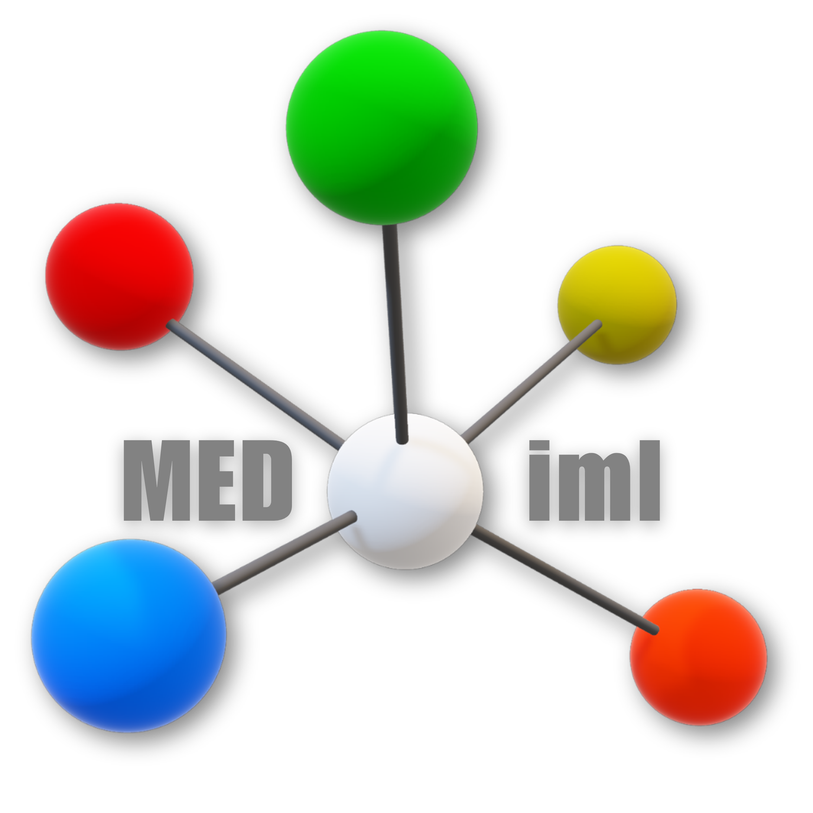

 

# MEDiml - The application

This application is part of the [MEDomics](https://github.com/MEDomicsLab/MEDomics) project. It allows the user to interact with the [MEDiml package](https://github.com/MEDomicsLab/MEDiml) through a graphical user interface, facilitating the extraction of radiomics features from medical images and the subsequent analysis of this data through machine learning models.

## Key Features

- **Graphical User Interface (GUI)**: Simplifies the interaction with the MEDiml package.
- **Radiomics Feature Extraction**: Extracts a wide range of radiomics features from medical images.
- **Data Analysis**: Integrates machine learning models for comprehensive data analysis.
- **Customizable Workflows**: Allows users to design and execute customized workflows tailored to specific research needs.

## Important Links

- [MEDiml-app Documentation](https://medomicslab.gitbook.io/mediml-app-docs)
- [MEDiml Python package](https://github.com/MEDomicsLab/MEDiml)
- [MEDomics Discord](https://discord.gg/ZbaGj8E6mP)

## Contact

For any question or support, please [contact us](https://medomicslab.gitbook.io/mediml-app-docs/forms/contact-us).

## Disclaimer

This application represents the latest version of the radiomics module used in MEDomics. We strive to keep both the application and the package synchronized to ensure the best user experience.
